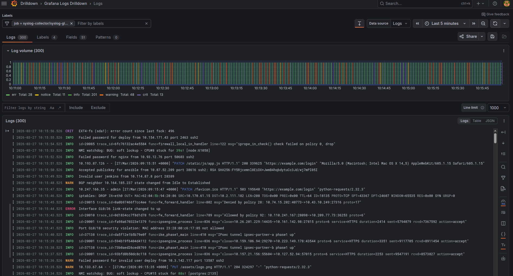

# opentelemetry-syslog-collector

A Helm chart that deploys a syslog collector using [syslog-ng](https://www.syslog-ng.com/) and the [OpenTelemetry Collector](https://opentelemetry.io/docs/collector/), managed by the [opentelemetry-operator](https://github.com/open-telemetry/opentelemetry-operator).

## Usage

```bash
helm install syslog oci://ghcr.io/evil8io/charts/opentelemetry-syslog-collector
```

## Example

Forward syslog messages to an OpenTelemetry gateway:

```yaml
configOverrides:
  exporters:
    otlp_http:
      endpoint: http://opentelemetry-gateway-logs.opentelemetry-gateway:4318
      headers:
        x-scope-orgid: my-tenant
```

See [values.yaml](values.yaml) for all configurable values.

## Ports and Protocols

The collector uses [syslog-ng `default-network-drivers()`](https://www.syslog-ng.com/technical-documents/doc/syslog-ng-open-source-edition/3.38/administration-guide/31) which exposes the following listeners:

| LB | LB Port | Container Port | Transport | Protocol | Framing | Format |
|---|---|---|---|---|---|---|
| tcpudp, udp | 514 | 514 | UDP | BSD ([RFC 5426](https://datatracker.ietf.org/doc/html/rfc5426)) | Datagram | [RFC 3164](https://datatracker.ietf.org/doc/html/rfc3164), [RFC 5424](https://datatracker.ietf.org/doc/html/rfc5424) (auto-detected) |
| tcpudp, tcp | 514 | 514 | TCP | BSD ([RFC 6587](https://datatracker.ietf.org/doc/html/rfc6587)) | Newline-delimited | [RFC 3164](https://datatracker.ietf.org/doc/html/rfc3164), [RFC 5424](https://datatracker.ietf.org/doc/html/rfc5424) (auto-detected) |
| tcpudp, tcp | 601 | 601 | TCP | IETF ([RFC 6587](https://datatracker.ietf.org/doc/html/rfc6587)) | Octet-counting | [RFC 5424](https://datatracker.ietf.org/doc/html/rfc5424) only |

Port 514 accepts both RFC 3164 and RFC 5424 message formats — syslog-ng auto-detects the format from message content. Port 601 requires RFC 5424 messages with RFC 6587 octet-counting framing.

> **Warning:** When using the `tcpudp` service (mixed-protocol NLB), use only a single transport (UDP or TCP) per source host. Mixing protocols from the same host may result in lost messages.

### Testing

BSD protocol (port 514) can be tested with `logger`:

```bash
logger --server <host> -P 514 --tcp --rfc3164 "test message"
logger --server <host> -P 514 --udp --rfc5424 "test message"
```

IETF protocol (port 601) can be tested with `logger --octet-count`:

```bash
logger --server <host> -P 601 --tcp --rfc5424 --octet-count "test message"
```

## Loadgen

The chart includes an optional traffic generator that produces realistic syslog messages from multiple simulated source profiles (firewall, switch, sshd, sudo, kernel, nginx, postfix). It exercises both RFC 3164 and RFC 5424 formats with varied hostnames, facilities, severities, and structured data.

```yaml
loadgen:
  enabled: true
  rate: 10
```

Profiles can be individually enabled/disabled with a relative weight controlling message distribution. See [values.yaml](values.yaml) for all options.

---


